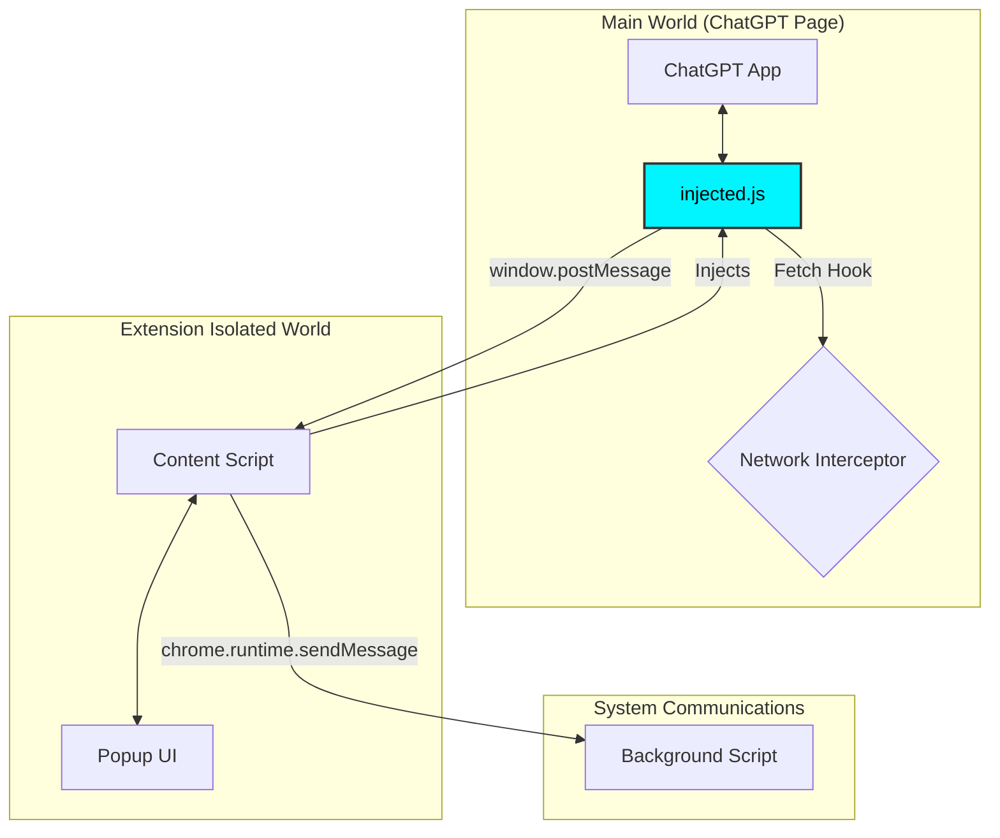

# 🏗️ ChatSpeed Technical Architecture

This document explains how **ChatSpeed** achieves near-constant-time performance by intercepting and optimizing ChatGPT’s conversation data at the network layer.

---

## 🛰️ System Architecture (Bridge Pattern)

Chrome extensions run in isolated environments.  
To intercept live network requests, ChatSpeed uses a Bridge Pattern to operate inside the page’s execution context.



---

## ✂️ The Surgical Graft Logic

The core of ChatSpeed is the **Surgical Graft**, a payload-level optimization that occurs before ChatGPT's React engine ever receives the data.

### The Interception Hook
ChatSpeed wraps the native `window.fetch` function. It targets only the conversation API and ignores all other requests:
- **Target:** `/backend-api/conversation/<uuid>`
- **Exclusions:** `gen_title`, `gen_message`, non-`GET` requests.

### The Pruning Algorithm
Instead of just "hiding" old messages, ChatSpeed reconstructs the conversation mapping:

1. **Root Identification:** Locates the conversation root node (the head of the tree).
2. **Tail Tracing:** Walks backward from the `current_node` (the latest message) and collects only the last **N nodes** (defined by `MAX_MESSAGES`).
3. **Graph Reconstruction:**
    - The **Root Node** is kept but its children are cleared.
    - The oldest message in our "kept" list is grafted as the **sole child** of the Root Node.
    - Subsequent messages are re-linked sequentially.
4. **Injection:** The original large response is replaced with a surgically reduced JSON payload.

### ⚡ Performance Impact
> By reducing the graph at the source, we bypass O(N) complexity in ChatGPT's React reconciliation, making UI performance O(1) relative to conversation length.

---

## 📊 Telemetry and Estimation Engine

ChatSpeed provides real-time feedback using a lightweight estimation model instead of relying on expensive runtime memory profiling.

### Estimation Formula
```text
BytesSaved = ∑ ( (TextLength × 2) + NodeOverhead ) × ComplexityFactor
```

- **TextLength × 2:** Accounts for UTF-16 encoding used by JavaScript strings.
- **NodeOverhead (1024B):** Constant estimate for the React node metadata and state footprint.
- **ComplexityFactor (1.5x):** Applied to code blocks (recognized by ` ``` `) due to higher rendering and parsing overhead.

---

## 🔒 Security and Isolation

ChatSpeed is designed to operate entirely within the browser. No user data leaves the local environment.

| Component | Responsibility | Security Isolation |
| :--- | :--- | :--- |
| **injected.js** | Network Interception | Main World (Access to Page JS) |
| **content.tsx** | Bridge & Local State | Isolated World (No Page JS Access) |
| **background.ts** | Metrics Relay | Extension Service Worker |

### Privacy Guarantees
- **No Persistence:** Conversation content is processed in ephemeral memory and never stored.
- **No External Calls:** The extension makes 0 network requests to external servers.
- **Local Analytics:** Metrics are calculated and displayed locally.

---

## 🚀 Scalability and Resilience

Because ChatSpeed operates at the **Network Layer** rather than the **DOM Layer**:

- **UI Resilient:** It works even if ChatGPT completely changes its HTML structure or CSS selectors.
- **Renderer-Agnostic:** It optimizes the source data that fuels the renderer, not the rendered output.
- **High Stability:** As long as the JSON API format remains consistent, ChatSpeed continues to function.

---

## 🔁 End-to-End Flow

1. ChatGPT requests conversation data  
2. Injected script intercepts the response  
3. Full conversation graph is received  
4. ChatSpeed prunes unnecessary nodes  
5. Reduced payload is returned  
6. React renders a minimal graph  

Result: constant-time rendering regardless of chat length

---

### ⚡ Key Insight
> Most performance tools attempt to fix the UI *after* it slows down. **ChatSpeed prevents the slowdown before the UI ever processes the data.**
